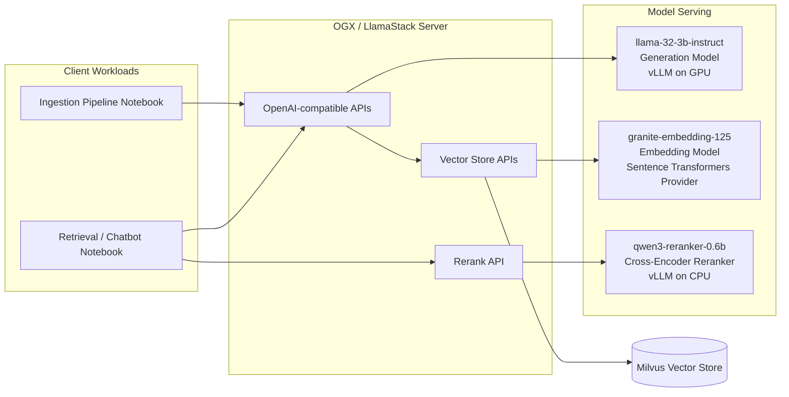
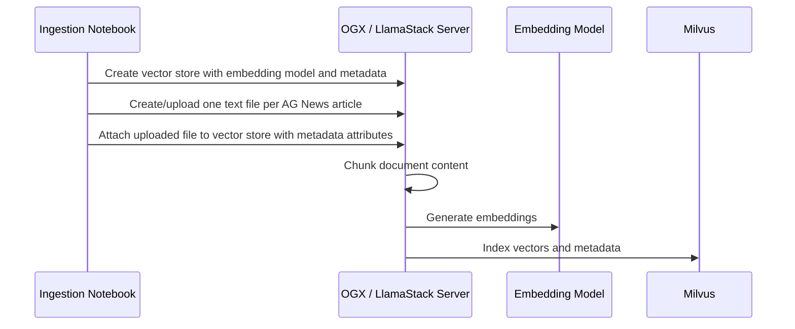
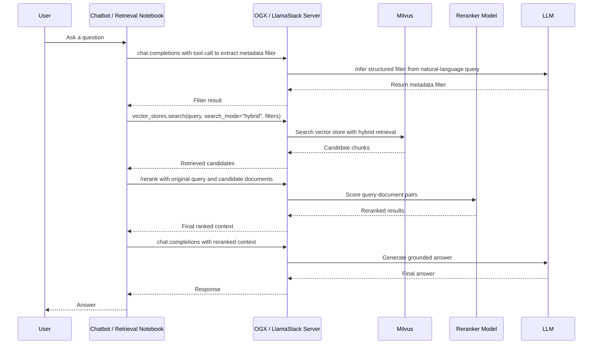

# AG News RAG Demo with Open GenAI Stack / LlamaStack

This repository demonstrates how to build a metadata-aware Retrieval-Augmented Generation (RAG) application using **Open GenAI Stack (OGX) / LlamaStack**, **Milvus**, **vLLM**, and the **AG News** dataset.

The demo shows how to evolve a basic semantic-search RAG pipeline into a more enterprise-ready retrieval architecture by combining:

- **Metadata filtering** to reduce the search space using structured attributes such as news category, tenant, and document type.
- **Hybrid search** to combine dense vector retrieval with keyword-based retrieval.
- **Neural reranking** using a cross-encoder model to improve the final ordering of retrieved candidates.

## Repository

```bash
git clone https://github.com/abdelhamidfg/agnews-rag-demo.git
cd agnews-rag-demo
```

## What This Demo Builds

The project deploys the core infrastructure for an AG News RAG application on **Red Hat OpenShift AI**:

- An OGX / LlamaStack server.
- A Milvus-backed vector store.
- A generation model served by vLLM.
- An embedding model used for document indexing and vector search.
- A cross-encoder reranker model used to rerank retrieved candidates.
- Jupyter notebooks for ingestion and retrieval workflows.

## Architecture

The high-level architecture includes an ingestion pipeline, a chatbot / retrieval notebook, the OGX server, Milvus, and three model roles: generation, embedding, and reranking.



## Deployed Models

| Model name | Purpose | Runtime |
|---|---|---|
| `llama-32-3b-instruct` | LLM used for query understanding and final answer generation | vLLM on NVIDIA GPU |
| `granite-embedding-125` | Embedding model used to create vector representations for AG News documents | OGX inline provider using sentence-transformers |
| `qwen3-reranker-0.6b` | Cross-encoder reranker used to score query-document pairs after retrieval | vLLM on CPU for demo purposes |

## Dataset

This demo uses the **AG News** dataset from Hugging Face. AG News contains news articles and category labels. In this project, the news category is attached as metadata and used during retrieval to improve search precision.

Example use case:

> Find business news about oil prices.

The retrieval pipeline can infer that the query is related to the `Business` category, build a metadata filter, run hybrid search, rerank candidate documents, and then generate a grounded response.

## Prerequisites

Before running the demo, make sure you have:

- Access to an OpenShift cluster.
- Red Hat OpenShift AI 3.4 or later installed.
- LlamaStack / OGX operator enabled.
- NVIDIA GPU Operator configured.
- At least one NVIDIA GPU available for the generation model, such as A10, A100, L40S, T4, or similar.
- `oc` CLI installed and configured.
- `helm` installed.
- Access to the OpenShift AI dashboard.

## Project Structure

```text
agnews-rag-demo/
├── chart/        # Helm chart for deploying the demo resources
└── notebooks/    # Jupyter notebooks for ingestion and retrieval pipelines
```

## Deployment Steps

### 1. Clone the repository

```bash
git clone https://github.com/abdelhamidfg/agnews-rag-demo.git
cd agnews-rag-demo
```

### 2. Log in to OpenShift

```bash
oc login --token=<token> --server=<server>
```

### 3. Create a new OpenShift project

```bash
PROJECT="agnews-rag-demo"
oc new-project ${PROJECT}
oc label namespace ${PROJECT} opendatahub.io/dashboard=true
```

### 4. Install the Helm chart

```bash
helm install agnews-rag-demo ./chart --set namespace=${PROJECT}
```

> Note: `--set namespace=${PROJECT}` passes the namespace value to the Helm chart. Make sure the chart templates reference this value consistently.

### 5. Create a workbench

Log in to the **OpenShift AI dashboard**, then create a workbench inside the `agnews-rag-demo` project.

Recommended workbench image:

```text
Jupyter minimal CPU
```

### 6. Upload the notebooks

Inside the created workbench, upload the notebook files from the cloned repository folder named `notebooks`.

Typical notebooks:

- `Ingestion_pipeline_ag_news`
- `retrieval_pipeline_ag_news`

## Ingestion Pipeline

The ingestion notebook uses a file-based ingestion pattern with OGX / LlamaStack Vector Stores.



The ingestion flow performs the following steps:

1. Creates a vector store configured with the selected embedding model.
2. Adds vector-store-level metadata such as `version_no` and `tenant_id` to support versioning and tenant isolation.
3. Converts each AG News row into a text document.
4. Uploads each document using the Files API.
5. Associates each uploaded file with the vector store.
6. Adds file-level metadata attributes such as `category` and document type.
7. Lets OGX handle chunking, embedding generation, and indexing into Milvus.

## Retrieval Pipeline

The retrieval notebook demonstrates metadata-aware, hybrid, reranked retrieval.



The retrieval flow performs the following steps:

1. The user asks a question such as: `Find business news about oil prices.`
2. The chatbot sends the query to the LLM using tool/function calling.
3. The tool call extracts structured metadata, for example a `category` filter.
4. The chatbot calls vector store search using the original query, the vector store ID, `search_mode="hybrid"`, and the extracted metadata filter.
5. The returned candidate documents are sent to the reranking endpoint.
6. The cross-encoder reranker scores each query-document pair.
7. The chatbot sends the reranked context to the LLM.
8. The LLM generates the final answer using only the retrieved and reranked context.

## Metadata Strategy

The demo shows three metadata levels commonly used in production RAG systems:

| Metadata level | Example fields | Use case |
|---|---|---|
| Vector-store metadata | `tenant_id`, `version_no`, domain, environment | Organize multiple knowledge bases and support versioning or tenant isolation |
| File/document metadata | `category`, document type, language, source | Filter retrieval to the right document group before semantic search |
| Chunk metadata | chunk ID, source file, section, token count | Improve traceability, explainability, and citation-level precision |

## Why Hybrid Search?

Vector search is strong for semantic similarity, while keyword retrieval is useful for exact terms, names, IDs, product codes, and domain-specific phrases. Hybrid search combines both approaches to improve recall and reduce missed results.

In OGX / LlamaStack, hybrid search can be enabled by using `search_mode="hybrid"` when calling the Vector Store Search API, with ranking options supported by the configured provider.

## Why Reranking?

Embedding-based retrieval usually relies on a bi-encoder architecture: the query and documents are embedded separately, then compared using vector similarity. This is fast and scalable, but it may miss deeper query-document interactions.

A cross-encoder reranker processes the query and each candidate document together as a pair and outputs a relevance score. This improves ranking quality, but it is more computationally expensive because inference is required for every query-document pair.

## Example Vector Store Search Payload

```json
{
  "query": "Find business news about oil prices",
  "filters": {
    "type": "eq",
    "key": "category",
    "value": "Business"
  },
  "max_num_results": 10,
  "search_mode": "hybrid",
  "ranking_options": {
    "score_threshold": 0
  },
  "rewrite_query": false
}
```

## Example Rerank Payload

```json
{
  "model": "qwen3-reranker-0.6b",
  "query": "Find business news about oil prices",
  "items": [
    "Candidate document 1 text...",
    "Candidate document 2 text..."
  ],
  "max_num_results": 5
}
```

## Troubleshooting

### Helm install fails because the namespace is not set

Make sure you pass the namespace value explicitly:

```bash
helm install agnews-rag-demo ./chart --set namespace=${PROJECT}
```

### Workbench cannot pull the notebook image

Check that the OpenShift internal image registry is available and that the workbench service account has permission to pull the selected notebook image.

### Model pod is pending because of GPU scheduling

Check GPU availability:

```bash
oc describe pod <pod-name> -n ${PROJECT}
oc get nodes -l nvidia.com/gpu.present=true
```

### LlamaStack cannot connect to Milvus

Check the Milvus endpoint and secret values. Milvus endpoints usually need a valid URI scheme such as `tcp://`, `http://`, or `https://`.

Example:

```bash
MILVUS_ENDPOINT="tcp://milvus-service:19530"
```

## Cleanup

To uninstall the Helm release:

```bash
helm uninstall agnews-rag-demo -n ${PROJECT}
```

To delete the project:

```bash
oc delete project ${PROJECT}
```

## Summary

This demo provides a practical implementation of an enterprise-style RAG pipeline using OGX / LlamaStack on OpenShift AI. It shows how to ingest AG News documents with metadata, store vectors in Milvus, retrieve with metadata filters and hybrid search, rerank results with a cross-encoder model, and generate grounded answers using an LLM.
